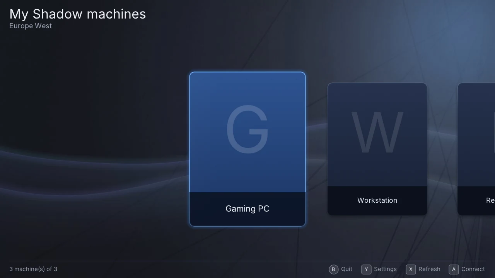
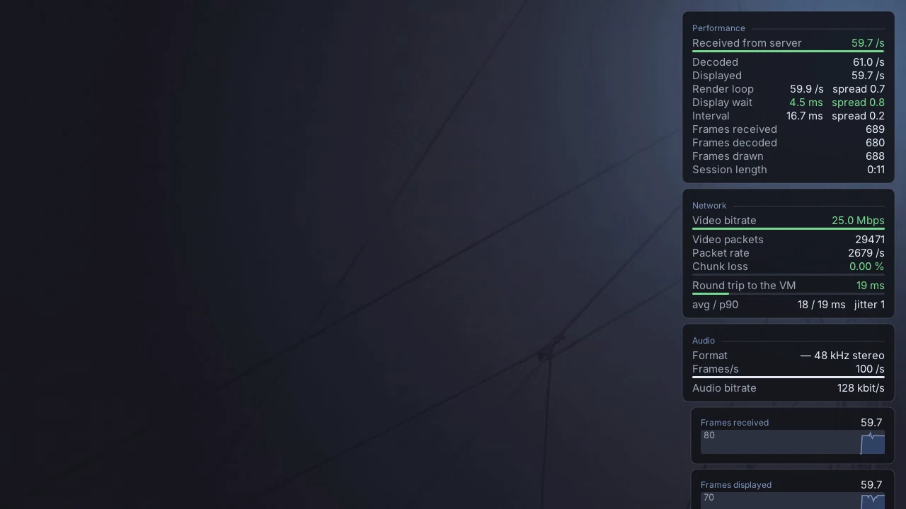
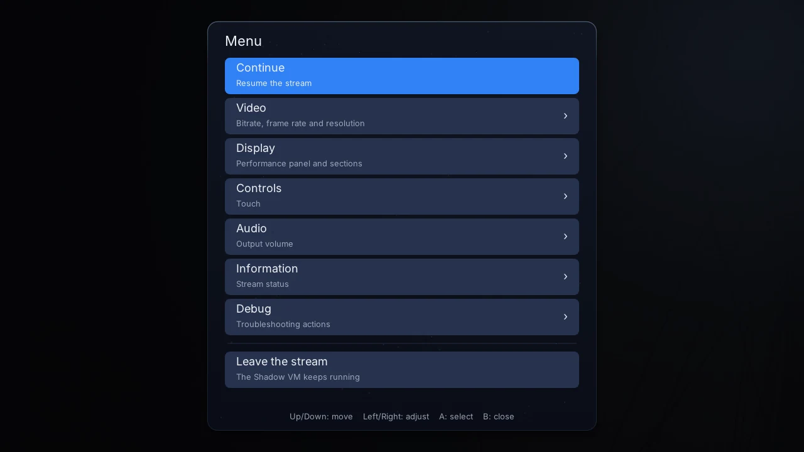
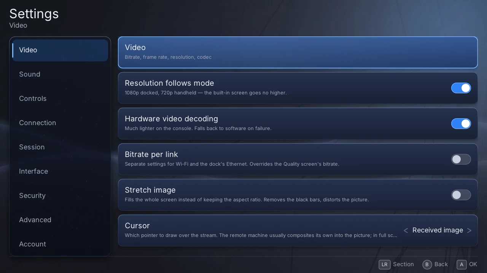

<p align="center">
  
</p>

<h1 align="center">Halyard</h1>

<p align="center">
  <strong>An unofficial client for the Shadow cloud PC service, on Nintendo Switch and PS Vita.</strong>
</p>

<p align="center">
  <a href="https://github.com/Wasabules/Halyard/releases/latest"></a>
  <a href="https://github.com/Wasabules/Halyard/releases"></a>
  <a href="LICENSE"></a>
  
</p>

<p align="center">
  <a href="https://github.com/Wasabules/Halyard/actions/workflows/build-switch.yml"></a>
  <a href="https://github.com/Wasabules/Halyard/actions/workflows/build-psvita.yml"></a>
  <a href="https://github.com/Wasabules/Halyard/actions/workflows/build-linux.yml"></a>
  <a href="https://github.com/Wasabules/Halyard/actions/workflows/build-windows.yml"></a>
  <a href="https://github.com/Wasabules/Halyard/actions/workflows/tests.yml"></a>
</p>

<p align="center">
  <a href="https://github.com/Wasabules/Halyard/releases/latest/download/halyard.nro"><strong>Download for Switch</strong></a> ·
  <a href="https://github.com/Wasabules/Halyard/releases/latest/download/halyard.vpk"><strong>Download for PS Vita</strong></a> ·
  <a href="https://wasabules.github.io/Halyard/docs/">Documentation</a> ·
  <a href="https://wasabules.github.io/Halyard/">Website</a>
</p>

Homebrew (Atmosphère on Switch, HENkaku on Vita) that reimplements the Shadow PC
streaming protocol, so a Shadow cloud machine can be played on a handheld
console.

> **Not affiliated with, endorsed by, or sponsored by Shadow, Nintendo, or Sony
> Interactive Entertainment.** Shadow is a trademark of its owner; Nintendo
> Switch and PlayStation Vita are trademarks of Nintendo and Sony Interactive
> Entertainment respectively. Those names appear here only to state which
> service this client speaks to and which hardware it runs on. **You need your
> own Shadow subscription**; nothing here circumvents one.
>
> **Use at your own risk.** Connecting with an unofficial client may breach
> Shadow's terms of service, and Shadow may suspend or terminate your account
> for it. Nobody here can prevent that or compensate you, and the licence
> disclaims all warranty and liability (GPL-3.0 §15-16). What the project does
> and does not do, and where EU law stands on interoperability research, is set
> out in [`docs/LEGAL.md`](docs/LEGAL.md) — read it before you install.

- **Install it** → [`docs/INSTALL.md`](docs/INSTALL.md)
- **Use it** → the [user guide](https://wasabules.github.io/Halyard/docs/): the
  screens, the controls, every setting, the FAQ (also in [`docs/guide/`](docs/guide/))
- **What changed** → [`CHANGELOG.md`](CHANGELOG.md)
- **Build it** → [`docs/BUILD.md`](docs/BUILD.md)
- **Something is wrong** → [Troubleshooting](#when-something-goes-wrong)
- **Legal, and the account risk** → [`docs/LEGAL.md`](docs/LEGAL.md)

## Screenshots

<table>
  <tr>
    <td></td>
    <td></td>
  </tr>
  <tr>
    <td align="center">Pick a machine</td>
    <td align="center">Stream, with the performance panel</td>
  </tr>
  <tr>
    <td></td>
    <td></td>
  </tr>
  <tr>
    <td align="center">Pause menu, during the stream</td>
    <td align="center">Settings</td>
  </tr>
</table>

<sub>The desktop build in its demo mode: the account, the machines and the
numbers are fictional, and nothing personal can appear. More in
<a href="docs/screenshots/">docs/screenshots/</a>; regenerated by
<code>tools/showcase-screenshots.sh</code>.</sub>

## What it does

You log in with your Shadow account, pick your machine, and it streams to the
console: picture, sound, and your inputs going back the other way.

- **Hardware video decoding on both consoles.** H.264 and HEVC through `nvtegra`
  on Switch, H.264 through `SceAvcdec` on Vita, drawn with the GPU's own colour
  conversion. Software decoding is a fallback, not the path.
- **Audio in Opus or FLAC**, whichever the server grants, with a 5-band
  equaliser and profiles that follow the console's mode.
- **Your controls reach the VM**: gamepad, and a mouse driven from the sticks or
  the touchscreen, with an on-screen keyboard.
- **The VM's own mouse pointer** is drawn, rather than a local approximation.
- **It measures itself.** Eleven latency stages at p50/p90/p99, packet loss, the
  link's estimated capacity — in the pause menu while you play, and in the log.
- **Settings that survive**, plus in-app testers for the network, the pad and
  the mouse, and an optional lock (PIN, pattern or password) on opening the app.

## What works, per console

|  | Nintendo Switch | PS Vita |
|---|---|---|
| Video, hardware decode | H.264 + HEVC | **H.264 only** |
| Choice of codec in settings | yes | no — the chip decodes H.264 |
| Audio (Opus / FLAC) | yes | yes |
| Gamepad to the VM | yes | yes |
| Mouse (sticks / touch) + on-screen keyboard | yes | yes |
| Rumble | yes | **no** — no such hardware |
| Gyroscope aiming | yes | **no** — not wired to SceMotion |
| Sleep / dock awareness | yes | not applicable |
| Validated over long play sessions | yes | early |

Neither console serves the VM's **clipboard** or its **microphone**. Those two
channels are understood but not implemented.

## What to expect, and what not to

**Expect it to depend on your network far more than on the console.** The
software budget for a frame is a handful of milliseconds; a Wi-Fi stall is
hundreds. On Switch over handheld Wi-Fi we measured eleven freezes of about
300 ms across 370 seconds of play — one such freeze wipes out the entire
software budget twenty times over. A wired link, where you can have one, changes
more than any setting in this app.

**Expect to cap the bitrate.** Above roughly 25 Mb/s the picture breaks up in
play: the server probes above what the link carries and loses on every probe.
25 Mb/s holds; 100 does not. The setting is in the pause menu.

**Do not expect desktop latency.** Measured end to end on hardware, the video
chain sits around 29 ms on Switch and the input path under 2 ms — good enough
for most games, not for competitive twitch play.

**Do not expect this to work without a Shadow subscription.** It is a client. It
authenticates as you, with your credentials, against your own machine.

**Do not expect the Vita port to be as settled as the Switch one.** It streams,
with hardware decode and sound, and the numbers are good — but it has far fewer
hours on it, and the two limitations above (no rumble, no gyro) are permanent
rather than pending.

## How it works

Shadow's desktop client opens about ten sockets to your VM, each with its own
job and its own transport. Halyard speaks the same protocol: a TLS control
channel carries the negotiation, then video, audio, input, gamepad and cursor
each run on their own port, encrypted with a ChaCha20-Poly1305 key the server
hands over during the handshake.

A session goes: OAuth device grant → start the VM and get its address → three
service tokens → two server-sent event streams (both, or the control port never
opens) → the TLS control channel → capabilities, authentication, encryption →
the channel announcements → the media starts flowing.

Video arrives as numbered chunks that are reassembled into frames and fed to the
console's hardware decoder as Annex-B. Everything above the protocol — the UI,
the settings, the decoders' plumbing — is shared between the two consoles;
what differs is named as a capability rather than as a platform
(`clients/borealis/device_caps.h`).

For the protocol itself, in detail, see the reverse-engineering notes at the
bottom of this file.

## Settings, and the file that overrides them

Most behaviour is a setting in the app. Underneath, each one drives a
`SHADOW_*` environment variable, and about 260 of them gate the streaming
path — every fix ships with a switch that reverts it, so a comparison needs no
rebuild.

A console passes no environment, so **a file does it**: put `KEY=VALUE` lines in
`env.txt` in the data directory. Only keys starting with `SHADOW_` are honoured,
each is read back and a mismatch is logged. **`env.txt` beats the settings
screen** — if a measurement contradicts what the screen shows, read that file
first. The app marks overridden settings on screen.

Data directory: `/switch/halyard/` on Switch, `ux0:data/halyard/` on Vita.

## When something goes wrong

The log is `halyard.log` in the data directory, with the previous sessions
numbered beside it. Set the level in Settings › Advanced, or with
`SHADOW_JOURNAL_NIVEAU=0..4` in `env.txt`.

- **"No internet access" at launch** — on Switch this is usually HOS in a
  degraded state after long uptime; reboot the console. Check the console's own
  connection first.
- **The picture breaks up while playing** — cap the bitrate at 25 Mb/s (see
  above).
- **Periodic micro-freezes with artefacts** — that pattern is packet loss
  feeding key-frame requests, which are themselves bursts that lose. Look at the
  loss figure in the pause menu.
- **No sound after reconnecting** — fixed, but if you see it, say which build.
- **A crash** — Atmosphère writes a report under `crash_reports/`; on Vita a
  `psp2core-*.psp2dmp` lands in `ux0:data/`. Both are useful.

**Before attaching a log to an issue, read it.** Logs carry session material and
are mirrored over the network when the log sink is configured. See
[`SECURITY.md`](SECURITY.md).

## Building

Short version, per target, in [`docs/BUILD.md`](docs/BUILD.md). Two things to
know before you start: `third_party/` is deliberately empty in a fresh clone —
no third-party source or archive is redistributed here — so the libraries are
fetched at pinned commits and built by two scripts:

```bash
tools/bootstrap-libs.sh          # fetch each library at its pinned commit, patch it
tools/build-libs.sh switch       # or: vita | linux
```

The offline test suite needs no console, no VM and no network:

```bash
./tests/run_tests.sh             # 53 suites, 139,400 checks (2026-09-26)
```

## Questions people ask

**Is there a PC, Mac or web version?** Not as a product. The client also builds
for Linux and Windows, but those are the development and test targets: the
interface is a full-screen gamepad UI made for consoles, and the binaries are
not packaged for release. On a computer or in a browser, Shadow's own apps are
the better choice.

**Could it run in a browser, through WebAssembly?** Not as it is. Halyard talks
to the machine over raw UDP and TCP sockets, with TLS that skips certificate
checks the way Shadow's desktop client does — none of which a web page is
allowed to do. It would need a relay server in between, which adds the latency
this project spends its time removing. Shadow's own browser client uses WebRTC
instead, a different protocol.

**Is it safe for my account?** Read [`docs/LEGAL.md`](docs/LEGAL.md). In short:
you sign in through Shadow's own login flow, and nothing is circumvented — no
authentication, no payment, no DRM — but using an unofficial client may still
breach the terms of service, and the risk is your account.

**Which version do I have?** Settings › About, or the entry in the Switch
homebrew menu. Every release is numbered from its git tag, and every package
built from that tag carries the same number.

## Contributing

Issues and pull requests are welcome. Two house rules that will save you a
review round:

- **Code and comments are in English**, including new code in a file that is not
  yet fully migrated.
- **A behaviour change ships with a toggle that reverts it**, and a comment
  saying what was measured to choose the default. That is how this project
  avoids re-litigating decisions: the reasoning lives next to the code.

## License

**GPL-3.0-or-later** — see [`LICENSE`](LICENSE).

That is not a preference. wolfSSL, which every TLS and DTLS channel goes
through, is GPL-3.0-or-later, and the FFmpeg build used on Switch is configured
`--enable-gpl`. Both impose copyleft on anything shipped with them, so the
combined work can only be GPLv3 or later. Apache-2.0 and MPL-2.0 components
(Borealis, Material Icons, Mbed TLS) are compatible **in that direction
only** — which is why the earlier Apache-2.0 licence on this project was not a
lighter choice but an impossible one.

Every component, its licence and where its text lives:
[`THIRD_PARTY_NOTICES.md`](THIRD_PARTY_NOTICES.md).

## Security

Report a vulnerability privately through GitHub's Security tab, not a public
issue. **Never attach a raw log or a packet capture** — see
[`SECURITY.md`](SECURITY.md).

## The protocol work

Shadow's protocol is closed, so most of this project was reverse-engineering the
official desktop client and porting what was found. That material is kept
deliberately, because it is worth more than the code:

- **[`KB.md`](KB.md)** — the single source of truth for every confirmed and
  hypothesised fact about the protocol, each tagged with a confidence level and
  its source. §9 is a reverse-chronological log that records **which hypotheses
  were later refuted** — read the top first.
- **[`memory/`](memory/MEMORY.md)** — 151 notes, one finding each.

The raw material behind those findings (captures, dumps, the official binary,
the instruments that produced them) is **not** in this repository and will not
be: it is not ours to publish, and some of it carries credentials.

A few results that shaped the client, if you want the flavour: the server sends
`max_chunks` as the **last index**, not a count, and that off-by-one cost the
bottom of every frame for months; there is **no FEC** in this protocol, despite
a field everyone reads as parity; and the channel map was wrong in three rows
until the official client was caught naming its own sockets in its telemetry.

## Contact

[Issues on GitHub](https://github.com/Wasabules/Halyard/issues) — the bug report
form asks for what is needed to act on it.
