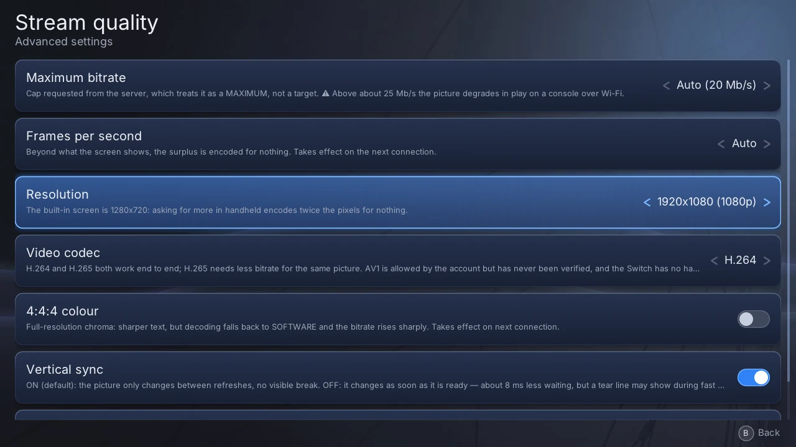
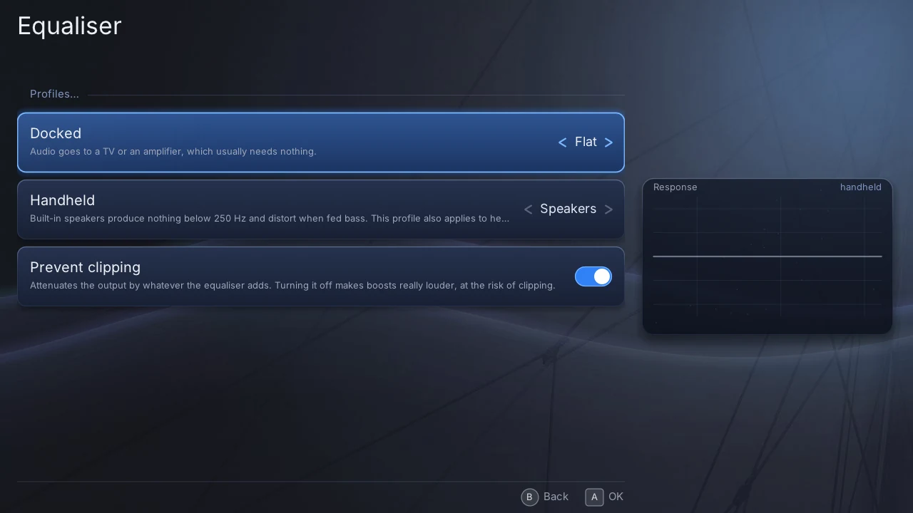
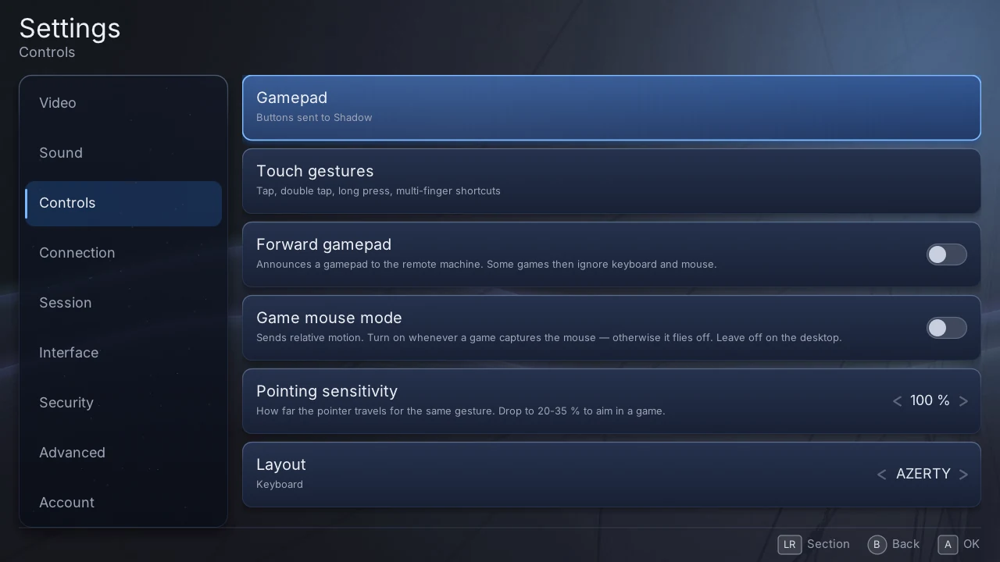

# Settings

Open the settings with **Y** from the machine list. **L** and **R** move between
sections, the D-pad moves between rows, **A** flips a switch or opens a page, and
**Left/Right** change a value. Every change is saved at once.

Some settings take effect on the **next connection**: the server fixes the
stream's resolution, codec and audio format when the session opens. The pause
menu has most of the settings that make sense while playing.

> A setting marked **"Forced by env.txt"** is being overridden by a file in the
> data directory, and what it shows is not what is running. See
> [Advanced](advanced.md#overriding-a-setting-with-envtxt).

## Video

| Setting | What it does | Default |
|---|---|---|
| **Video** | opens the [stream quality](#stream-quality) page | |
| **Resolution follows mode** | 1080p when the Switch is docked, 720p in handheld — the built-in screen shows no more | on |
| **Hardware video decoding** | decodes with the console's video chip, far lighter than software; falls back to software on failure. Not on the Vita, which always uses its chip | on |
| **Bitrate per link** | a separate maximum bitrate for Wi-Fi and for the dock's Ethernet (Switch), replacing the one on the quality page | off |
| **Wi-Fi bitrate** / **Ethernet bitrate** | the two maxima, when *Bitrate per link* is on | 15 / 40 Mb/s |
| **Stretch image** | fills the screen instead of keeping the picture's proportions — no black bars, a distorted picture | off |
| **Cursor** | which pointer is drawn over the stream: *the machine's own* (drawn into the picture by Windows), *the received image* (Halyard draws the machine's pointer itself, which also works in full-screen games) or a plain *arrow* | received image |

### Stream quality

| Setting | What it does | Default |
|---|---|---|
| **Maximum bitrate** | the ceiling asked of the server, which treats it as a maximum, never a target. **Above about 25 Mb/s the picture degrades in play on a console** — see [Picture, sound and network](performance.md) | 20 Mb/s |
| **Frames per second** | the frame rate asked of the server: 30, 60, 90, 120, 144 or automatic | 60 |
| **Resolution** | 720p, 900p, 1080p or 1440p | 720p |
| **Video codec** | H.264 or H.265 (HEVC), which needs less bitrate for the same picture. AV1 is listed but has never been verified | H.264 |
| **Vertical sync** | on: the picture changes only between screen refreshes, no tearing. Off: about 8 ms less waiting, at the risk of a tear line in fast motion | on |
| **Profile** | *lowest latency* or *best quality*, as the server understands them, or automatic | automatic |

The defaults above are a console's; a desktop build starts on automatic bitrate
and frame rate, at 1080p. Frame rate, resolution and codec are not offered on the
Vita, whose video chip decodes H.264 only. A desktop build also offers **4:4:4
colour**, for sharper text at the cost of software decoding and a much higher
bitrate.

## Sound

| Setting | What it does | Default |
|---|---|---|
| **Volume** | 0 to 300 %. Above 100 % the sound is boosted, and loud passages clip | 100 % |
| **Audio quality** | *high fidelity* asks for lossless FLAC (about 900 kbit/s instead of 100 for Opus). Next connection | off (Opus) |
| **Hardware audio decoding** | Switch only: decodes Opus with the console's service. Saves a few percent of one core, costs a round trip per packet | off |
| **Equaliser** | opens the [equaliser](#equaliser) | |

### Equaliser

A tonal correction of the machine's sound, with **one profile for docked and one
for handheld**, since a TV and the console's own speakers need different things.
The curve on the right shows what the current profile does.

| Setting | What it does | Default |
|---|---|---|
| **Docked** | the profile used on a TV: flat, speakers, headphones, voice, quiet listening or custom | flat |
| **Handheld** | the profile used on the built-in speakers, which give nothing below 250 Hz | speakers |
| **Prevent clipping** | lowers the output by whatever the equaliser adds, so boosts cannot distort | on |
| **Adjust the bands** | with a *custom* profile: five bands, each with its type, frequency (30 Hz–16 kHz), width and gain (±12 dB) | |

The same settings are in the pause menu › Audio › Equaliser, where you hear the
result as you change it.

## Controls

| Setting | What it does | Default |
|---|---|---|
| **Gamepad** | opens the [gamepad](#gamepad) page | |
| **Touch gestures** | opens the [touch gestures](#touch-gestures) page | |
| **Forward gamepad** | announces a gamepad to your machine. Some games then ignore the keyboard and mouse | on |
| **Game mouse mode** | sends mouse movement instead of positions — turn it on in games that capture the pointer, off on the desktop | off |
| **Pointing sensitivity** | how far the pointer moves for the same finger movement, 10–200 %. Around 20–35 % for aiming in a game | 100 % |
| **Layout** | the on-screen keyboard's letters: AZERTY or QWERTY | AZERTY |

### Gamepad

| Setting | What it does | Default |
|---|---|---|
| **Test the controller** | shows what the console reads, button by button, and — during a stream — what is sent to the machine next to it. If the two differ, the fault is Halyard's | |
| **Test the pointing** | the pointer, the sensors and the buttons in figures; sends nothing | |
| **Announced controller type** | what your machine believes is plugged in: Xbox 360, Xbox One, DualShock 4, a single Joy-Con, or generic. Next connection | Xbox 360 |
| **Button mapping** | one row per console button: which button it becomes on the announced controller, or none | by position |
| **Invert vertical stick axis** | swaps up and down on both sticks | off |
| **Stick dead zone** | how far a stick must move before it counts, 0–40 % | 10 % |
| **Rear touch panel** | Vita only: turns the four quarters of the back panel into ZL, ZR, L3, R3 or analogue triggers, each with a tap, hold or slide gesture | off |
| **Motor test** | Switch only: the rumble strength, and a test of each motor | 100 % |
| **Restore the default mapping** | back to the mapping by position | |

To leave a tester, **hold B** until the bar fills.

### Touch gestures

For one, two and three fingers, what a **tap**, a **double tap** and a **long
press** do: nothing, a left, right or middle click, a double click, a drag, the
on-screen keyboard, the pause menu, Escape, the Windows key or Alt+Tab. The
defaults are listed in [Controls](controls.md#the-touchscreen).

A double tap left on *Automatic* repeats the single tap, so a tap clicks at once.
Giving the double tap its own action makes every single tap wait 0.4 s, to see
whether a second one follows.

## Connection

| Setting | What it does | Default |
|---|---|---|
| **Auto-connect** | connects on its own when the account has a single machine | on |
| **Video over TCP** | Shadow's "reliability" profile: nothing is lost, but the server no longer adapts its bitrate. Next connection | off |
| **Register the input channel** | an experiment that may let the machine see a gamepad more reliably. Check that the mouse and keyboard still work | off |

## Session

| Setting | What it does | Default |
|---|---|---|
| **Stop when leaving the app** | Switch only: the HOME menu and sleep end the session. Keeping it is a gamble — the console may stop the app anyway | on |
| **Auto-reconnect** | reconnects on its own when the stream dies unexpectedly | on |
| **Attempts** | how many times it tries, 1 to 5 | 3 |

## Interface

| Setting | What it does | Default |
|---|---|---|
| **Interface sounds** | small sounds on navigation and confirmation; silent during a stream | on |
| **Sound volume** | their volume, separate from the game's | 70 % |
| **Haptic feedback** | Switch only: a short vibration on limits and toggles; off during a stream | 60 % |
| **Interface size** | 75 to 200 % | 100 % (75 % on Vita) |
| **Language** | the console's language, French or English. Restart the app to apply | console language |

## Security

The **application lock** asks for a code before the app opens. Choose one or
several methods:

- **PIN** — 4 to 12 digits.
- **Pattern** — a path across a 3×3 grid, drawn with a finger or the D-pad.
- **Password** — 4 to 63 characters, typed on the system keyboard.

**Re-lock on wake** (Switch, on by default) asks again after sleep or the HOME
menu. **Remove the lock** removes every method at once. After four wrong
attempts, each new one has to wait, up to ten minutes.

Setting a lock also seals your saved session, so it can no longer be read off
the memory card. The other files in the data directory stay readable.

## Advanced

| Setting | What it does | Default |
|---|---|---|
| **Log level** | how much the app writes to its log: failures only, normal, detailed or everything | normal |
| **Development channel** | lets a computer read the log and take screenshots — see [Advanced](advanced.md#development-tools). On by itself when a destination is configured | off |
| **Space used** | the size of the logs kept | |
| **View the log** | reads the log on the console: the current session and the previous ones (**Y**) | |
| **Clear the logs** | empties the current log and deletes the older ones | |
| **Settings forced by env.txt** | lists what `env.txt` is overriding | |
| **Reset settings** | puts every setting back to its default; play time is kept | |

## Account

| Setting | What it does |
|---|---|
| **Sign out** | forgets your session and quits the app; the next launch asks you to link the console again |
| **Replay from the start** / **Replay, pairing included** | go back to the start screen without closing the app — the second one also forgets the session, so the sign-in code comes back. Useful to record the whole journey |

## About

The version and build of the app, its licence and source, and your **play time**
today, this month and in total (sessions of ten seconds or more).
