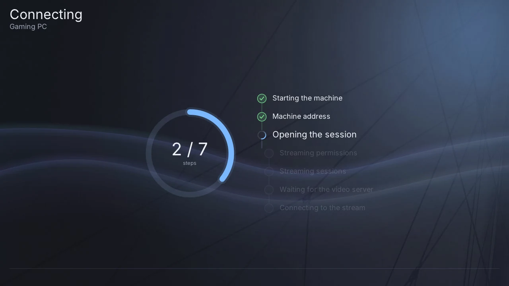

# Using Halyard

A session goes: **the machine list → connecting → the stream**, with the pause
menu over the stream whenever you need it. This page walks through each screen.
The buttons are named as on a Switch; [Controls](controls.md) has the PS Vita
equivalents.

## The machine list

After signing in you land on the machines of your Shadow account, one tile each.
The top of the screen shows the data centre you are served from, your plan and
whether Shadow Drive is available.

| Button | Action |
|---|---|
| **A** (or tap a tile) | connect to that machine |
| **X** | refresh the list |
| **Y** | open the [settings](settings.md) |
| **B** | quit the app (it asks first) |

**If your account has a single machine, Halyard connects to it on its own**, half
a second after the list appears. Press **Y** within that half second to go to the
settings instead, or turn off *Auto-connect* in Settings › Connection.

If a refresh fails, the previous list stays on screen with a sentence saying
what went wrong, so a short network hiccup never empties it.

## Connecting

The connection goes through seven steps, shown as a checklist: starting the
machine, getting its address, opening the session, the streaming permissions
and sessions, waiting for the video server, and connecting to the stream.

- **A machine that is off is started first.** The address step then counts its
  attempts (`n/30 The machine is starting…`) while it boots, which can take a
  minute or two.
- **B** cancels and goes back to the list.
- If a step fails, the screen says why in a sentence, with the error code beside
  it, and **A** retries.

## The stream

Once connected, the picture fills the screen. Everything you do is sent to your
machine: the buttons, the sticks, the touchscreen as a mouse, and the on-screen
keyboard. [Controls](controls.md) details what each input does.

- **Waiting for video** appears for a moment while the machine prepares the
  stream.
- **"Picture frozen for N s"** appears in orange when no picture has arrived for
  five seconds: the network has stalled, or the machine stopped sending.
- **If the stream dies unexpectedly, Halyard reconnects on its own** — up to
  three times by default (Settings › Session).
- The console does not dim its screen or go to sleep while you watch.

## The pause menu

**Hold + on a Switch, or START on a Vita, for half a second.** A short press is
not the menu: it is the game's own Start button. By default a three-finger long
press on the touchscreen opens it too.

In the menu, the D-pad or the left stick moves, **A** selects, **Left/Right**
change a value, and **B** goes back a page — or closes the menu from its first
page. You can also tap the rows. While the menu is open, nothing is sent to the
game and the controller stops vibrating.

| Entry | What is inside |
|---|---|
| **Continue** | back to the stream |
| **Video** | the maximum bitrate (applied at once), frame rate and resolution (next connection), stretching the picture, and the **Link quality** page |
| **Display** | the **performance panel** — turn it on, choose its sections and graphs, arrange its blocks, their opacity and refresh rate — and the interface size |
| **Controls** | the controller tester, the **controller mouse**, the touchscreen mode, pointing sensitivity, game mouse mode, stick settings |
| **Audio** | volume, audio quality, and the equaliser for the current console mode |
| **Information** | the video stream, the frame rate, the console mode and the network link |
| **Debug** | troubleshooting actions: announce the controller again, ask for a fresh key frame, refresh the picture, switch between hardware and software decoding |
| **Leave the stream** | ends the session and returns to the list. **Your machine keeps running** |

The performance panel and the Link quality page are explained in
[Picture, sound and network](performance.md).

## Leaving

**Leave the stream** in the pause menu ends the session and brings you back to
the machine list; your Shadow machine keeps running, and you can reconnect from
the list later.

On a Switch, going to the HOME menu or putting the console to sleep also ends
the session by default. Turn off *Stop when leaving the app* in Settings ›
Session to try to keep it — the console may stop the app anyway.

To quit Halyard altogether, press **B** on the machine list, or **+** on any
screen outside a stream.

## The app lock

In Settings › Security you can require a **PIN**, a **pattern** or a
**password** to open the app. The lock screen then appears before anything
touches your account, and on a Switch it can ask again after sleep or a trip to
the HOME menu. After four wrong attempts, each new one has to wait: 30 seconds,
then a minute, two, five, and ten at most.

Setting a lock also **seals your saved session**: from then on it cannot be read
off the memory card from a computer. The lock protects opening the app — the
other files in the data directory stay readable.
